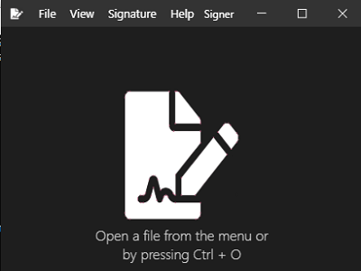
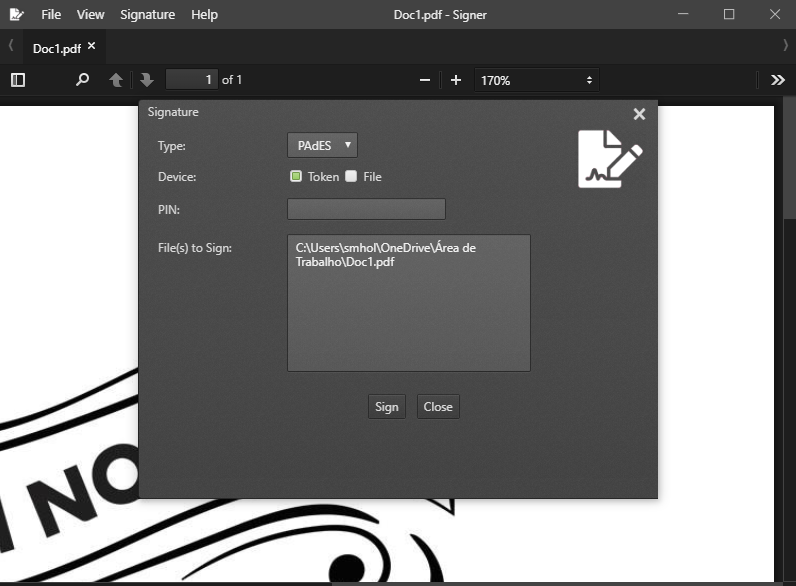
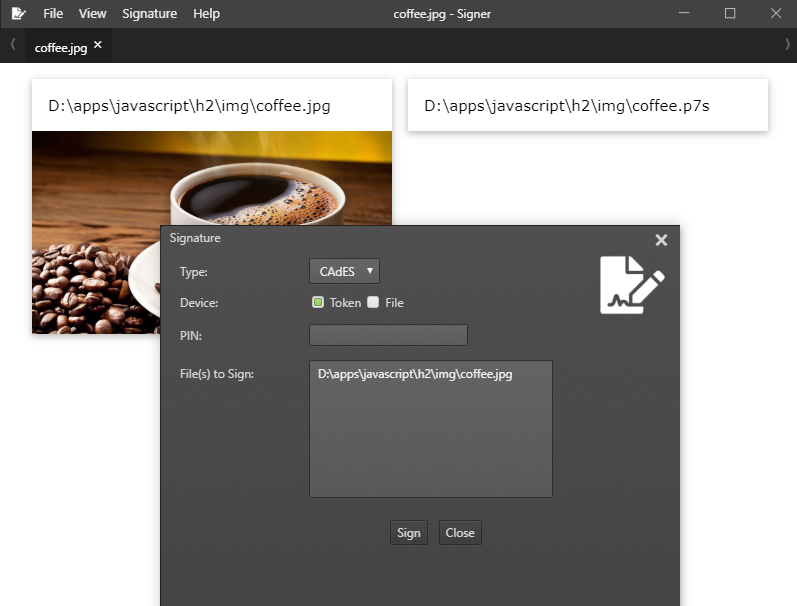
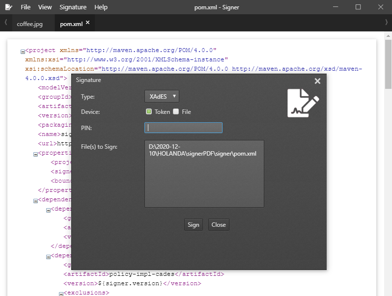
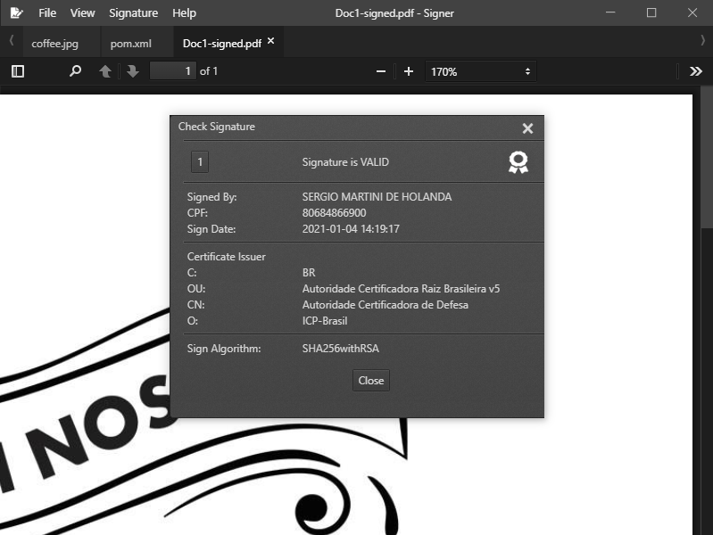
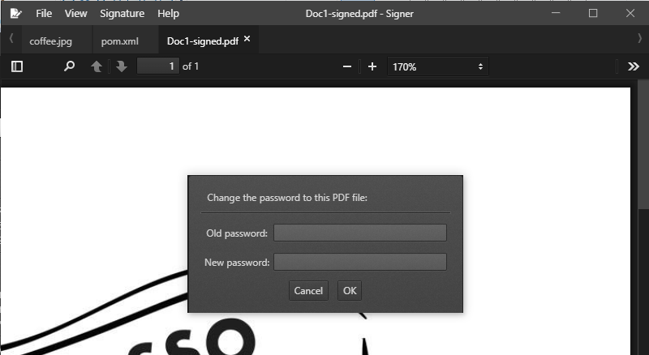

# Introduction

Signer is an application for ICP-Brasil Digital Signature.

The Signer is based on the Demoiselle Signer, which is a component that facilitates the generation of digital signatures. The component implements the signature standard in accordance with ICP-Brasil's policies and ICP-Brasil's resolutions. The Signer front end is based on Lector, which is a PDF reader.

The main features are: 
- digital signature of files in PAdES, XAdES, XSig and CAdES formats;
- configuration of subscription template; 
- inclusion and exclusion of passwords in PDF files.

This project depends on the SignerJAR project. So the signer-0.0.1-jar file is already included at the root of the project. If you want to make changes, just build the SignerJAR project.

## Getting Started

Clone this repository locally :

``` bash
git clone https://github.com/holanda-h2/signer.git
```

Install dependencies with npm :

``` bash
npm install
```

To start the application :

``` bash
npm start
```

To build the application :

``` bash
npm run dist
```


## Included Commands

|Command|Description|
|--|--|
|`npm install`| Install dependencies with npm |
|`npm start`| To start the application |
|`npm run dist`| To build the application . |

## Screens







